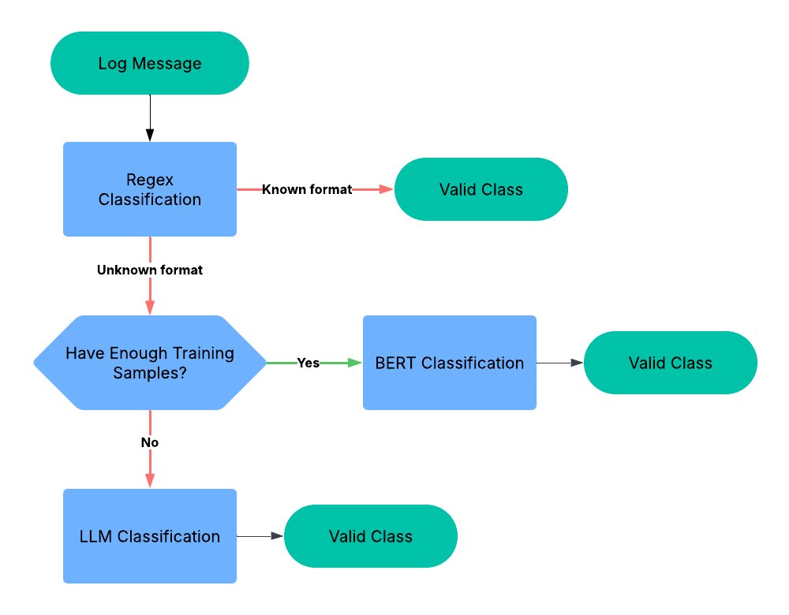

# Optimized Log Classification Using LLMs
A comprehensive framework for hybrid log classification that integrates multiple analytical techniques to effectively process and categorize log data.
This system leverages different methods to handle simple, complex, and sparsely labeled log patterns.
 ---

## Overview

This project combines three primary classification strategies:

- **Regex-based Classification**
  Captures predictable patterns using predefined regular expressions.

- **Embedding-based Classification**
  Uses Sentence Transformers to generate embeddings followed by Logistic Regression for nuanced pattern recognition.

- **LLM-assisted Classification**
  Employs large language models to classify data when traditional methods struggle due to limited labeled samples.



---

## Directory Structure

- **`training/`**
  Contains notebooks and scripts for training the models and experimenting with different approaches.

- **`models/`**
  Stores pre-trained models such as the logistic regression classifier and embedding models.

- **`resources/`**
  Holds auxiliary files like CSV datasets, output samples, and images.

- **Root Directory**
  Includes the main API server (`server.py`) and the command-line classification utility (`classify.py`).

---

## Installation & Setup

1. **Clone the Repository**
   ```bash
   git clone https://github.com/yuva-raja-reddy/Optimized-Log-Classification-Using-LLMs.git
   ```

2. **Install Dependencies**
   Ensure Python is installed and run:
   ```bash
   pip install -r requirements.txt
   ```

3. **Train the Model (if needed)**
   Open and run the training notebook:
   ```bash
   jupyter notebook training/log_classification.ipynb
   ```

4. **Run the API Server**
   Start the server using one of the following methods:
   - Direct execution:
     ```bash
     python server.py
     ```
   - With Uvicorn:
     ```bash
     uvicorn server:app --reload
     ```
   Access the API documentation at:
   - Main Endpoint: [http://127.0.0.1:8000/](http://127.0.0.1:8000/)
   - Swagger UI: [http://127.0.0.1:8000/docs](http://127.0.0.1:8000/docs)
   - Redoc: [http://127.0.0.1:8000/redoc](http://127.0.0.1:8000/redoc)

5. **Running the Streamlit App**
   To start the Streamlit application for log classification:
   ```bash
   streamlit run app.py
   ```
   This command will launch the app in your browser at a URL like http://localhost:8501.
---

## Usage Instructions

- **Input Data**
  Upload a CSV file with the following columns:
  - `source`
  - `log_message`

- **Output**
  The system processes the logs and returns a CSV file with an additional `target_label` column indicating the classification result.

---

## Customization

Feel free to modify and extend the classification logic in the following modules:
- `processor_bert.py`
- `processor_llm.py`
- `processor_regex.py`

These modules are designed to be flexible, allowing you to tailor the classification approaches to your specific needs.

---
